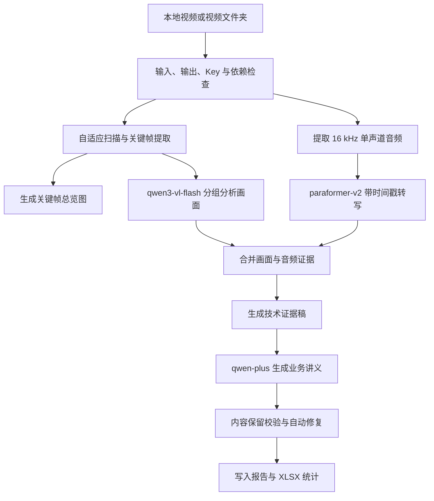

# video-course-to-markdown

将本地课程视频转换为可追溯的中文 Markdown 讲义，并输出关键帧、画面/音频证据、处理报告以及逐视频耗时与模型用量统计。

支持单个视频和文件夹批处理，支持递归扫描子文件夹及断点续跑。输入与输出均使用本地路径；关键帧、音频和文本会发送到阿里云百炼 DashScope 完成模型推理。

## 功能概览

- 支持 `.mp4`、`.mov`、`.mkv`、`.avi`、`.webm`、`.m4v`。
- 默认使用 `qwen3-vl-flash` 分析画面、`paraformer-v2` 转写音频、`qwen-plus` 整理业务讲义。
- 文件夹模式逐个处理视频，单个视频失败后继续处理其余视频。
- 生成技术证据稿和学员业务讲义，尽量避免摘要过程静默丢失课程内容。
- 生成 `视频处理统计.xlsx`，记录逐视频耗时、视觉/文本 Token、批次总 Token 和 ASR 音频时长。
- 通过带来源指纹的检查点复用已完成阶段，支持在中断后使用相同命令继续运行。
- API Key 只从环境变量或私有 `.env` 读取，不写入 Markdown、JSON、Excel 或处理日志。

## 运行要求

- Codex 桌面端、Codex CLI 或 IDE 扩展。
- Python 3.10 或更高版本。
- 能访问阿里云百炼 DashScope 的网络。
- 系统已安装 FFmpeg，或允许脚本安装隔离的 `imageio-ffmpeg`。
- 阿里云百炼 API Key。当前可分别配置 Qwen 与 Paraformer 两个 Key，也支持未来统一为一个 Key。

Python 依赖包括 `pillow`、`numpy`、`imageio-ffmpeg`、`certifi` 和 `openpyxl`。缺少依赖时，Skill 会按照自身说明把它们安装到用户目录下的隔离位置，不污染项目源码目录。

## 安装

OpenAI 的 [Skills 官方说明](https://developers.openai.com/codex/skills) 支持使用 `$skill-installer` 从其他代码仓库安装 Skill。在 Codex 中发送：

```text
请使用 $skill-installer 从 https://github.com/Terry-J-Ola/video-course-to-markdown 安装根目录中的 skill，安装名称为 video-course-to-markdown。
```

安装后可输入 `$video-course-to-markdown` 检查是否能选中该 Skill。Codex 通常会自动发现新安装的 Skill；如果没有显示，重启 Codex 后再试。

> 当前仓库适合通过 `$skill-installer` 做个人或本地安装。若以后希望通过通用插件目录面向更广泛用户分发，可再将它封装为 Codex Plugin。

## 第一次使用

### 1. 配置 API Key

推荐把私有配置保存到：

```text
%LOCALAPPDATA%\Codex\video-course-to-markdown\.env
```

当前使用两个 Key 时，文件内容为：

```dotenv
DASHSCOPE_QWEN_API_KEY=填写用于Qwen模型的Key
DASHSCOPE_ASR_API_KEY=填写用于Paraformer模型的Key
```

以后两个 Key 统一后，可以改成：

```dotenv
DASHSCOPE_API_KEY=填写统一Key
```

也可以把 `.env` 放在其他安全位置，并在运行时指定 `--env-file`。不要把真实 Key 提交到 Git 仓库，也不要把它粘贴到对话中。

配置读取优先级如下：

1. 当前进程已有的环境变量。
2. 显式传入的 `--env-file`；使用后不再回退查找其他 `.env`。
3. Skill 根目录的 `.env`。
4. `%LOCALAPPDATA%\Codex\video-course-to-markdown\.env`。

### 2. 先执行 dry-run

dry-run 只检查输入、配置和执行计划，不调用模型，也不创建输出目录。在 Codex 中发送：

```text
使用 $video-course-to-markdown，对 "D:\courses\inputs" 做一次 dry-run，输出目录为 "D:\courses\outputs"，包含子文件夹。
```

确认计划中的输入路径、输出路径和模型无误后再进行真实处理。

### 3. 执行第一次真实处理

```text
使用 $video-course-to-markdown，处理文件夹 "D:\courses\inputs"，输出到 "D:\courses\outputs"，包含子文件夹。
```

第一次真实运行如果缺少 Python 依赖，Codex 会先按 Skill 说明安装隔离依赖。处理时间取决于视频长度、关键帧数量、网络和百炼接口限流情况。

## 日常使用

### 处理单个视频

```text
使用 $video-course-to-markdown，处理 "D:\courses\lesson-01.mp4"，输出到 "D:\courses\outputs"。
```

单视频产物会集中在：

```text
D:\courses\outputs\lesson-01\
```

### 批量处理文件夹

只处理文件夹第一层：

```text
使用 $video-course-to-markdown，处理文件夹 "D:\courses\inputs"，输出到 "D:\courses\outputs"。
```

同时包含子文件夹：

```text
使用 $video-course-to-markdown，处理文件夹 "D:\courses\inputs"，输出到 "D:\courses\outputs"，包含子文件夹。
```

批处理按照相对路径排序后顺序执行，并为每个视频建立独立输出子目录。输出根目录共享一份 `视频处理统计.xlsx` 和 `批量处理报告.json`。

### 常见可选要求

可以直接在自然语言请求中说明，也可以让 Codex 映射为对应参数：

| 需求 | 参数 |
|---|---|
| 只查看计划，不调用模型 | `--dry-run` |
| 递归处理子文件夹 | `--recursive` |
| 只生成技术证据稿 | `--skip-business` |
| 确认视频没有有效音频 | `--skip-asr` |
| PPT/录屏课件 | `--mode slides` |
| 真人演示视频 | `--mode live` |
| 自动判断抽帧模式 | `--mode auto` |
| 遇到接口限流时降低并发 | `--workers 1` 或 `--workers 2` |
| 应用人工术语修正 | `--corrections "D:\secure\corrections.json"` |
| 使用指定私有配置 | `--env-file "D:\secure\video-course.env"` |

人工修正文件是 UTF-8 JSON，例如：

```json
{
  "莱塞尔": "莱赛尔",
  "实洗": "石洗"
}
```

### 直接使用命令行

通常建议由 Codex 调用 Skill。如果需要在仓库根目录直接运行，CMD 示例为：

```cmd
python scripts\run_video_course_pipeline.py "D:\courses\inputs" "D:\courses\outputs" --recursive
```

单视频并显式指定私有 `.env`：

```cmd
python scripts\run_video_course_pipeline.py "D:\courses\lesson-01.mp4" "D:\courses\outputs" --env-file "D:\secure\video-course.env"
```

若提示缺少依赖，先执行：

```cmd
python scripts\bootstrap_dependencies.py
```

脚本会返回隔离依赖目录。后续统一入口会自动发现默认目录；也可以通过 `--pydeps` 显式传入。

## 输出内容

每个成功处理的视频通常包含：

| 产物 | 用途 |
|---|---|
| `*_业务讲义.md` | 面向学员阅读的中文业务讲义 |
| `*_技术证据稿.md` | 带时间信息和画面证据的可追溯底稿 |
| `*_技术证据稿_assets/` | 技术证据稿引用的关键帧图片 |
| `*_关键帧总览.jpg` | 快速人工复核画面覆盖情况 |
| `*_画面证据.json` | 结构化视觉分析结果 |
| `*_音频证据.json` | 带时间戳的音频转写结果 |
| `*_提取音频.mp3` | 从视频提取的音频 |
| `*_内容保留校验.json` | 业务讲义的缺失内容、技术泄漏和缺图检查 |
| `*_处理报告.json` | 模型、阶段、时间、输出路径与用量摘要 |
| `视频处理统计.xlsx` | 逐视频、逐模型及批次统计 |
| `_video_course_work/` | 支持复核与断点续跑的中间结果和检查点 |

批处理根目录还会生成 `批量处理报告.json`，其中包含视频总数、成功/失败数量和失败项。

Excel 工作簿包含三个工作表：

- `逐视频统计`：每个视频的开始/结束时间、总耗时、各阶段耗时、实际模型、视觉与文本 Token、ASR 音频时长、状态和错误信息。
- `模型Token汇总`：按实际模型名称汇总输入、输出和总 Token。
- `批次汇总`：汇总视频数量、成功/失败数量、处理总耗时、批次总 Token 和 ASR 音频总时长。

`paraformer-v2` 不返回 Token，统计表会按音频时长记录其用量，不会伪造 ASR Token。

## Skill 内部处理流程



1. **发现输入并校验配置**：识别单文件或文件夹，筛选支持的视频扩展名，解析输出目录、模型参数、API Key 和隔离依赖。dry-run 在这里输出计划后停止。
2. **自适应抽帧**：先按扫描频率提取候选帧，再根据 `auto`、`slides` 或 `live` 模式筛选关键画面。课件模式倾向保留页面变化，真人演示模式会控制时间间隔和重复画面。
3. **画面理解**：把关键帧按组发送给 `qwen3-vl-flash`，提取可见文字、界面状态、步骤、数字和其他画面事实。请求支持有限并发、重试和结构化 JSON 校验；无效响应会保留为诊断材料，但不会被写成可复用检查点。
4. **音频转写**：通过 FFmpeg 提取 16 kHz 单声道 MP3，再由 `paraformer-v2` 生成带时间戳的句子。画面模型不会被当作音频事实来源。
5. **证据合并**：按时间线组合视觉与音频结果，复制引用图片，生成技术证据稿和结构化证据 JSON。若提供人工修正表，会在这一阶段统一修正术语。
6. **业务讲义转换**：`qwen-plus` 在保留定义、数字、完整步骤、案例和原始话术的前提下，把技术证据稿整理成更适合学习的中文讲义。
7. **内容保留校验**：检查必保内容缺失、技术标记泄漏和图片缺失。发现缺失时最多执行两轮自动修复；仍无法恢复的原课程内容会明确补入讲义，而不是静默省略。
8. **统计与报告**：写入阶段耗时、实际模型和接口返回的 Token。批量模式会把所有视频汇总到同一工作簿，并记录失败项后继续处理下一视频。

## 断点续跑

处理被中断后，使用相同输入、相同输出目录和相同参数再次运行即可。Skill 会检查输入文件身份、模型以及抽帧/分组参数：

- 指纹一致的关键帧、视觉分组结果和 ASR 转写会被复用。
- 输入文件、模型或相关参数改变时，只重新计算受影响的阶段。
- `--skip-asr` 产生的跳过状态不会阻止后续正常执行 ASR。
- 已复用的旧模型结果不会被误记为本次指定的新模型，也不会重复计算为本次 Token。

在业务讲义和证据完成复核前，建议保留 `_video_course_work/`。确认不再需要断点续跑和问题诊断后，可以删除该中间目录；正式 Markdown、JSON、图片、音频和 Excel 产物不受影响。

## 安全与隐私

- 输入视频和最终产物路径在本地，但模型处理所需的关键帧、音频和文本会上传到阿里云百炼。
- API Key 不应进入仓库、对话、日志或任何输出产物。
- 仓库已忽略 `.env` 和常见开发过程目录；提交前仍应使用 `git status` 检查是否误加入私密文件。
- 不要通过关闭 SSL 证书验证来解决网络问题；脚本使用 `certifi` 信任链并保留主机名与证书校验。

## 常见问题

**安装后找不到 Skill**

重启 Codex，然后输入 `$video-course-to-markdown` 或通过 `/skills` 查找。

**提示未配置 Qwen 或 ASR Key**

检查 `.env` 文件名、位置和变量名。真实运行必须有 Qwen Key；只有明确使用 `--skip-asr` 时才不要求 ASR Key。

**提示缺少 FFmpeg、Pillow、OpenPyXL 等依赖**

让 Codex 按 Skill 说明执行依赖引导，或在仓库根目录运行 `python scripts\bootstrap_dependencies.py`。

**遇到 DashScope 限流或临时网络错误**

流程会重试临时错误；仍失败时降低 `--workers`，并用同一命令断点续跑。

**批处理返回非零退出码**

只要有一个视频失败，批处理最终就会返回失败状态，但其他视频仍会继续。查看根目录的 `批量处理报告.json`、`视频处理统计.xlsx` 和失败视频的处理报告。

**能否在新项目中直接使用**

安装在个人 Skill 目录后可跨项目使用，不需要每新建一个项目就重新安装。只有更换电脑、用户环境或删除已安装 Skill 后才需要重新安装。

## 开发校验

在仓库根目录运行：

```cmd
python -m unittest discover -s tests -v
python -m compileall -q scripts
```

`tests/` 是发布前回归测试的一部分，建议保留在仓库中；安装后的 Skill 正常运行不依赖测试目录。发布前还应使用 Codex 自带的 Skill 校验器检查目录结构和 `SKILL.md` 元数据。
